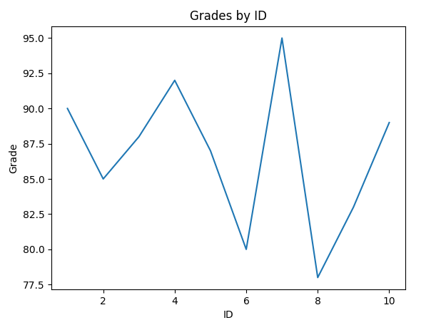

# PY_tutorial


## Day 1 创建列表

创建长度为10的数组，传入参数 i， 返回长度为 10 的数组，其中每个值为 i * index 

```python
# 样例1：
input: 1
output: [0, 1, 2, 3, 4]

# 样例2：
input: 5
output: [0, 5, 10, 15, 20]
```

测试命令

```python
pytest all_test.py::test_create_array
```


## Day 2 查找元素

给定一个整数数组 `nums` 和一个整数值 `target`, 请你找出在数组中找出为该值 `target` 的整数们，并返回它们的所有数组下标。

**示例1**

```
输入：nums = [3,3], target = 3
输出：[0,1]
```

**示例2**

```
输入：nums = [2,7,11,15, 7], target = 7
输出：[1, 4]
```

**测试命令**

```
pytest all_test.py::test_lookup_num
```


## Day3

使用 `pandas`读取 excel 文件， 并使用 matplotlib 画出折线图，其中 横坐标为 name， 纵坐标为 grade。


| ID  | Name    | Grade |
|-----|---------|-------|
|  1  | Alice   |  90   |
|  2  | Bob     |  85   |
|  3  | Charlie |  88   |
|  4  | Diana   |  92   |
|  5  | Edward  |  87   |
|  6  | Frank   |  80   |
|  7  | Grace   |  95   |
|  8  | Hank    |  78   |
|  9  | Ivy     |  83   |
| 10  | Jack    |  89   |

测试命令

```bash
pytest all_test.py::test_plot_from_excel
```




